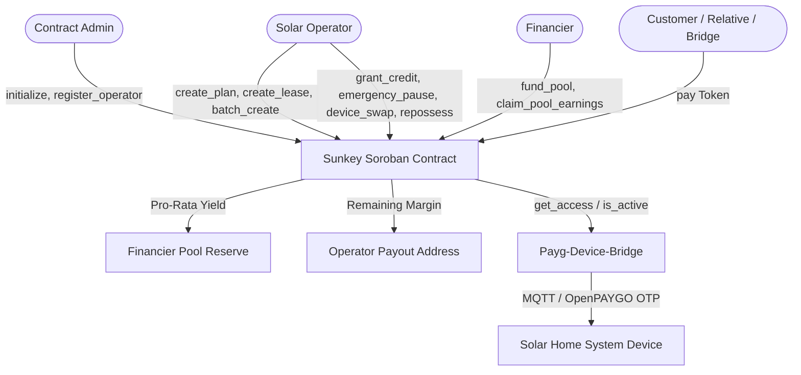

# Payg-energy-contracts

> High-integrity Soroban smart contracts for the **Sunkey-PaygEnergy** solar and clean energy platform on the Stellar network.

[](https://github.com/Sunkey-PaygEnergy/Payg-energy-contracts/actions/workflows/ci.yml)
[](https://opensource.org/licenses/MIT)
[](https://soroban.stellar.org)

---

## 1. Architecture Overview

Sunkey-PaygEnergy enables clean energy operators to sell Solar Home Systems (SHS) on pay-as-you-go credit. Customers pay an initial deposit and micro top-ups. Each payment grants days of energy access. When credit expires, connected or offline devices lock. Once total payments reach the cash price, the device permanently unlocks (`Owned` status).



---

## 2. Threat Model & Security Posture

| Threat Vector | Description | Contract & System Mitigation |
| :--- | :--- | :--- |
| **Device Tampering** | Physical bypass of internal relay or clock modification to keep device permanently ON without payments. | Leases require cryptographically signed activation tokens (OpenPAYGO standard) with monotonic cycle counters. On-chain `paid_until` serves as source of truth; bridge flags devices whose reported energy consumption exceeds authorized runtimes. |
| **Fake Payment Notifications** | Attackers sending fabricated mobile-money receipts or mock webhook callbacks to unlock devices. | Contract accepts token transfers exclusively via Stellar/Soroban token clients where `payer.require_auth()` is verified cryptographically. Bridge only triggers payments on-chain after verifiable clearing from mobile-money gateways. |
| **Bridge Key Compromise** | Malicious actor extracting the bridge relayer key to submit unauthorized contract calls. | Bridge relayer key is strictly restricted to payer operations (`pay()`). All operator-privileged methods (`create_lease`, `repossess`, `device_swap`, `set_suspended`) enforce operator signature checks. Relayer funds are throttled via HSM/KMS. |
| **SMS Spoofing** | Attacker broadcasting fake SMS unlock codes or intercepting customer OTPs. | Unlock codes are generated deterministically using shared secret HMACs / OpenPAYGO token standards. Devices reject codes with non-sequential or replayed counters. On-chain lease state tracks payment sequences. |

---

## 3. Storage & Fleet Scale TTL (Rent Management)

To support fleets of tens of thousands of solar leases without eviction risk:
- **Instance Storage**: Reserved for singleton configuration (`Admin`, global sequence trackers). Auto-bumped with `INSTANCE_BUMP_AMOUNT = 100_000` ledgers.
- **Persistent Storage**: Utilized for `Operator`, `Plan`, `Lease`, `Device`, `Pool`, and `PoolFinancier` records.
- **Rent Extension (`extend_ttl`)**: Invoked automatically during state access with `PERSISTENT_LIFETIME_THRESHOLD = 100_000` and `PERSISTENT_BUMP_AMOUNT = 500_000` ledgers (~28 days), guaranteeing persistence across fleet operations.

---

## 4. Contract Methods

### Governance & Operator Management
- `initialize(admin: Address)`: Bootstrap contract authority.
- `set_admin(new_admin: Address)`: Rotate admin key with current admin authentication.
- `register_operator(operator: Address, name: String, payout_address: Address)`: Register licensed operator.
- `set_operator_active(operator: Address, active: bool)`: Pause or reinstate operator operations.
- `update_operator_payout(operator: Address, new_payout: Address)`: Update operator revenue destination.

### Pricing Plans
- `create_plan(operator, plan_id, name, token, daily_rate, total_price, deposit_amount, min_payment, grace_period_seconds)`
- `set_plan_active(operator, plan_id, active: bool)`

### Financier Pools
- `create_pool(operator, pool_id, token, name, target_amount, repayment_bps)`: Register inventory financing pool with repayment basis points (e.g., 7000 = 70%).
- `fund_pool(financier, pool_id, amount)`: Financier funds inventory; capital transfers directly to operator payout address.
- `claim_pool_earnings(financier, pool_id) -> i128`: Financier withdraws pro-rata earnings accumulated from lease payments.
- `get_claimable_pool_earnings(pool_id, financier) -> i128`: Read pending pro-rata distributions.

### Leases & Batch Ingestion
- `create_lease(operator, lease_id, customer, plan_id, device_id, pool_id)`: Deploy individual unit with optional deposit.
- `batch_create_leases(operator, leases: Vec<BatchLeaseInput>) -> u32`: Gas-optimized mass device deployment.

### Payments & Overpayment Capping
- `pay(payer: Address, lease_id: u64, amount: i128) -> i128`:
  - Authorized by payer (customer, relative, or payment bridge).
  - Calculates pro-rata revenue splitting between operator payout and financier pool.
  - Capped to remaining payoff balance (`total_price - total_paid`).
  - Upon full payoff, status transitions to `Owned` with permanent unlock (`paid_until = u64::MAX`).

### Customer Protection & Lifecycle
- `grant_credit(operator, lease_id, days, reason)`: Goodwill or promotional energy days.
- `emergency_pause(operator, lease_id, pause_duration_seconds, reason)`: Late-fee-free disaster freeze preserving active countdown.
- `request_plan_change(operator, lease_id, new_plan_id)` & `accept_plan_change(customer, lease_id)`: Dual-consent plan migration.
- `device_swap(operator, lease_id, new_device_id, reason)`: Serial number swap preserving financial ledger.
- `transfer_lease_customer(current_customer, new_customer, lease_id)`: Reassign lease with customer consent.
- `set_suspended(operator, lease_id, suspended, reason)`: Operational lock toggle.
- `repossess(operator, lease_id, reason)`: Protected repossession requiring expiration past `paid_until + grace_period_seconds`.

### Telemetry Queries
- `is_active(lease_id: u64) -> bool`: Real-time boolean power state.
- `get_access(lease_id: u64) -> AccessStatus`: Rich state including `Active`, `GracePeriod`, `Locked`, `Owned`, `Suspended`, `Repossessed`, or `Paused`.

---

## 5. Development & Testing

Run the unit test suite:
```bash
cargo test
```

Build the release WASM artifact:
```bash
stellar contract build
```

The compiled bytecode is output to `target/wasm32-unknown-unknown/release/sunkey_contracts.wasm`.

---

## 6. Testnet Deployment Directives

Deploy to Stellar Testnet following standard network directives:

```bash
# 1. Verify test suite
cargo test

# 2. Generate and fund deployer identity
stellar keys generate deployer --network testnet --fund

# 3. Build optimized contract WASM
stellar contract build

# 4. Deploy contract to testnet
stellar contract deploy \
  --wasm target/wasm32-unknown-unknown/release/sunkey_contracts.wasm \
  --source deployer --network testnet --alias sunkey

# 5. Initialize contract
stellar contract invoke --id sunkey --source deployer --network testnet -- \
  initialize --admin $(stellar keys address deployer)

# 6. Retrieve native XLM testnet token SAC ID
stellar contract id asset --asset native --network testnet
```

Deployment metadata is automatically recorded to `deployments/testnet.json`.

---

## 7. TypeScript Client SDK

TypeScript bindings are generated and packaged under `packages/contracts-sdk`:

```bash
cd packages/contracts-sdk
npm install
npm run build
```

Import in applications:
```typescript
import { Client } from "@sunkey/contracts-sdk";

const client = new Client({
  contractId: "CDLZFC3SYJYDZT7K67VZ75HPJVIEUVNIXF47ZG2FB2RMQQVU2HHGCYSC",
  networkPassphrase: "Test SDF Network ; September 2015",
  rpcUrl: "https://soroban-testnet.stellar.org",
});
```
